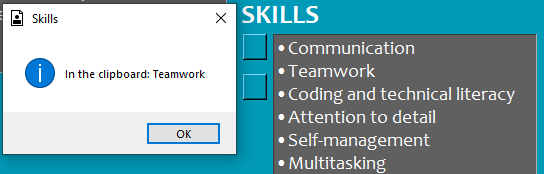

# Easy Apply
- Have you ever been annoyed by the repetitive nature of the job applications?
    - Most of the time the data extraction from your resume(if there is an option at all) do not work properly, so you need to select and copy-paste the same information over and over again every time you apply for a new role
- `Easy Apply` let you add the information into your clipboard by just clicking on a button of the selected field

<br>
<div align="center">
     
</div>
<br>

# Requirements
### Install packages\dependencies
``` pip install -r requirements.txt ```

### Separately
### Python 3 - used: 3.11
- https://www.python.org/

### Pyperclip
- https://pypi.org/project/pyperclip/

### OS
- `Windows` (tested on 11)

# Guide - Tkinter
- The app window opens at the right, top corner of the screen
    - optimised for `27" - 2560x1440` monitor
    - for smaller display, the `PyQt` version recommended (in rogress)
- The first row of the `Contacts` automatically added to the clipboard at the start of the app when the `copy_to_clipboard_page_1` set to true in `json/settings`
- `Skills`:
    - the 1st button copies the skill list in bulk/together
    - the 2nd button copies the skills ony by one, pop-up message displaying the current skill in clipboard, jumps to the next skill, once the pop-up message is closed
- At the launch of the 2nd page the `Achievements` field value automatically added to the clipboard when the `copy_to_clipboard_page_2` set to true in `json/settings`

<br>
<div align="center">
     
</div>
<br>


## Thank you all who worked on the modules used in this project!