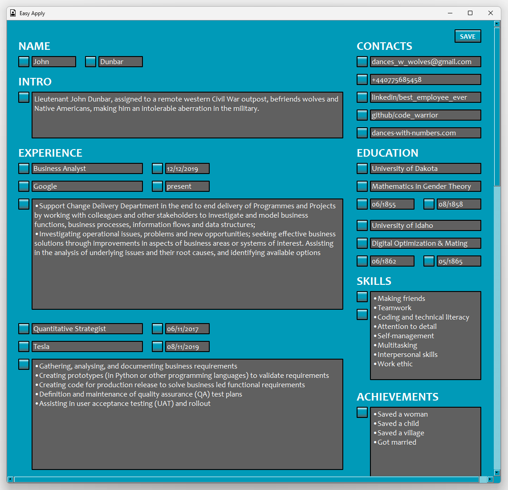
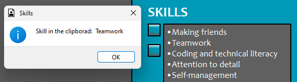

# Easy Apply
- Have you ever been annoyed by the repetitive nature of the job applications?
    - Most of the time the data extraction from your resume(if there is an option at all) do not work properly, so you need to select and copy-paste the same information over and over again every time you apply for a new role
- `Easy Apply` let you add the information into your clipboard by just clicking on a button of the selected field

<br>
<div align="center">
     
</div>
<br>

# Requirements
### Install packages\dependencies
```
pip install -r requirements.txt
```
### Separately
### Python 3 - used: 3.11
- https://www.python.org/

### Pyperclip
- https://pypi.org/project/pyperclip/

### OS
- `Windows` (tested on 10)

# Guide
- The app window opens at the right, top corner of the screen
    - optimised for 27" display
    - on a 17" display it is still usable
- The first row of the `Contacts` automatically added to the clipboard at the start of the app
- The 2nd page (with more `Experience` and other options) is available by clicking on the `2nd button`
- `Skills`:
    - the 1st button copies the skill list in bulk/together
    - the 2nd button copies the individual skills separately, pop-up message displaying the current skill in clipboard, jumps to the next skill, once the pop-up message is closed

<br>
<div align="center">
     
</div>
<br>

# Modules used, which are part of Python 3.11
- json
- os
- pathlib
- tkinter

## Thank you all who worked on the modules listed in this document!